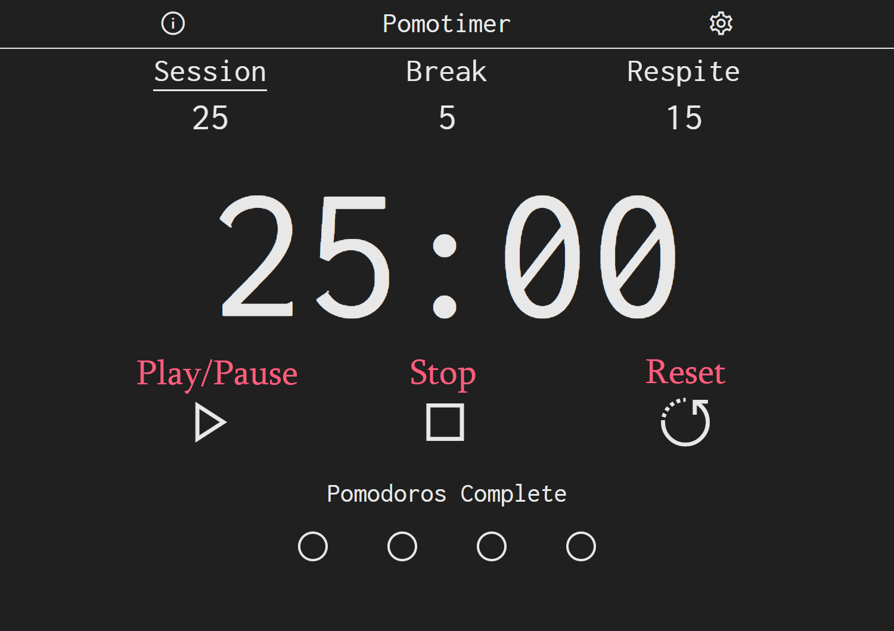

<h1 align="center">Pomodoro</h1>

<h4 align="center">Minimalist Pomodoro timer with customizable session/break times and colors.</h4>

# What is the Pomodoro Technique

The [*Pomodoro Technique*](https://en.wikipedia.org/wiki/Pomodoro_Technique) is a method to manage time through work and break intervals. Traditionally, the timer goes through four intervals of work (25 minutes) and breaks (5 minutes) with the last break being longer, usually around 15 minutes. One pomodoro equals one complete session. After four pomodoros are complete the long break starts, and then the timer restarts to the beginning with no pomodoros complete. Its purpose is to build discipline by enforcing sessions of work with no distractions and breaks to let the mind relax for a short amount of time before continuing with work.

## How to use

### Time Options

    Click to select
  
1. Session
2. Break
3. Respite

### Controls

1. Play/Pause - Play or pause the timer
2. Stop - Reset the currently selected time (this will not reset any pomodoros)
3. Reset - Reset the timer, including all pomodoros

### Change Time Length

Change time length in the settings.

### Keyboard Shortcuts

* Controls
  * SPACE - Play/Pause
  * ALT + S - Stop
  * ALT + R - Reset
* Time Options
  * ALT + P - Session
  * ALT + B - Break
  * ALT + L - Respite

## Gulp Tasks

    Run tasks with "npx gulp", e.g. "npx gulp build"

* Development
  * concat - Concatenate all scripts and stylesheets
  * copy - Copy all needed files
  * build - concat + copy
  * cleanAll - Remove all files from dist, excluding .git
  * cleanVendor - Remove all files from vendor
  * default - cleanAll + build
  * watch - Watch all HTML, CSS, and JavaScript files for changes. On change, runs default
* Production
  * concatProduction - Same as development, except with scripts and vendor scripts wrapped in a self-executing function
  * buildProduction - concatProduction + copy
  * production - cleanAll + buildProduction

## Features

* Customizable Times - From one minute up to one hundred hours.
* Pre-built Color Themes - Choose from a variety of hand-picked themes.
* Custom Themes - Make a theme with any colors you want!
* Keyboard Shortcuts - For faster use.
* Preferences - Customize the timer in the settings menu.
* Notifications - Get alerted when a time session finishes.
* Local Storage - All preferences are saved locally.

## Tech

* [Express](https://expressjs.com/) - Simple web server to serve static files.
* [Gulp](https://gulpjs.com/) - Streaming build system. Automates concatenating and minifying files.
* [Spectrum](https://bgrins.github.io/spectrum/) - Color picker used to make a custom theme.
* [jQuery](https://jquery.com/) - Serves up spectrum.

The majority of the core application is made in vanilla HTML, CSS, and JavaScript.

## License

[MIT](LICENSE)
